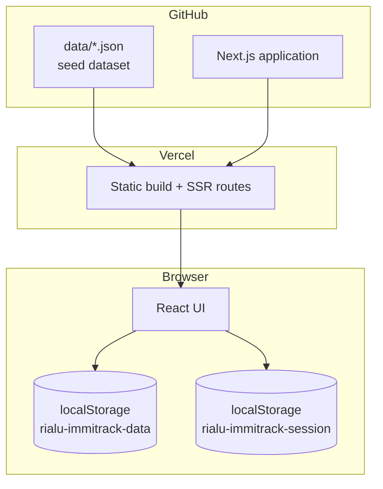

<p align="center">
  <strong style="font-size: 1.5rem;">Rialu ImmiTrack</strong><br/>
  <sub>Immigration case management for modern law firm teams</sub>
</p>

<p align="center">
  <a href="https://github.com/LegalTechGraeme/rialu-immitrack-web">Repository</a>
  ·
  <a href="#quick-start">Quick start</a>
  ·
  <a href="#architecture">Architecture</a>
  ·
  <a href="#data-model">Data model</a>
</p>

---

## Overview

**Rialu ImmiTrack** is a demo immigration case platform built for corporate law firms and in-house immigration teams. It provides two distinct portals — an internal **immigration team** view and a **corporate client** view — over a shared case dataset.

The application is intentionally **serverless and database-free**: demo data ships as JSON in the repository, and user edits persist in the browser. This keeps deployment trivial (Vercel, zero configuration) while the architecture remains ready for a production database and real LLM integration later.

| Attribute | Detail |
|-----------|--------|
| **Language** | TypeScript |
| **Framework** | Next.js 16 (App Router) + React 19 |
| **Styling** | Tailwind CSS 4 + Rialu design tokens |
| **Persistence** | JSON seed files + `localStorage` |
| **Auth** | Demo session only (role picker on landing page) |
| **AI** | Rule-based summaries today; LLM-ready interfaces |

---

## Portals

### Immigration team

Full caseload management for solicitors and paralegals.

| Route | Purpose |
|-------|---------|
| `/employee` | Team overview — stats, priority queue, AI briefing |
| `/employee/cases` | All cases — search, filter, **inline status updates** |
| `/employee/cases/[id]` | Case detail — documents, timeline, notes, AI brief |
| `/employee/reports` | Expiry pipeline, work-in-progress, compliance gaps |
| `/employee/intelligence` | Portfolio-level AI insights and high-attention cases |

### Corporate client

Scoped view for HR / mobility teams at client organisations.

| Route | Purpose |
|-------|---------|
| `/client` | Dashboard — cases for the selected organisation |
| `/client/cases` | Full case list with status controls |
| `/client/cases/[id]` | Case detail — documents, notes, timeline |

**Role switching** happens only on the landing page (`/`). Use **Exit demo** to return and select a different portal. There is no in-app role toggle — by design.

### Case status workflow

```
Intake → Gathering documents → Submitted to ISD → Under review
                              → Additional info requested
                              → Approved | Refused | On hold
```

| Actor | Can update status to |
|-------|----------------------|
| Immigration team | All statuses |
| Corporate client | Gathering documents, Submitted to ISD, On hold |

Every status change writes to the **activity timeline** and raises a **notification**.

---

## Architecture



### Request flow

1. **Build time** — Next.js bundles the app; JSON seed files are imported as static modules.
2. **Runtime** — Pages are client-rendered (`"use client"`). On first load, `lib/store.ts` hydrates state from `localStorage` or falls back to seed data.
3. **Mutations** — Status changes, notes, and notifications update in-memory state and sync back to `localStorage`. No network calls.

### Design system

Visual language is aligned with **Rialu Graph** — warm legal-document aesthetic, not generic SaaS blue.

| Token | Value | Usage |
|-------|-------|-------|
| `--bg` | `#F7F6F2` | Page background |
| `--navy` | `#1E3A5F` | Primary actions, brand |
| `--gold` | `#9A7B2F` | AI accents, highlights |
| `--surface` | `#FFFFFF` | Cards, sidebar |

**Typography:** Cormorant Garamond (headings) · DM Sans (UI)

---

## Data model

Seed files live in `data/` and define the initial demo state.

```
data/
├── clients.json        # Corporate organisations (3)
├── applicants.json     # Immigration cases (8)
├── documents.json      # Per-case document checklist
├── notifications.json  # Team alert feed
├── timeline.json       # Activity history
└── notes.json          # Case notes (internal + client-visible)
```

### Core entities

| Entity | Key fields |
|--------|------------|
| **Client** | `id`, `name`, `industry` |
| **Applicant** | `id`, `clientId`, `firstName`, `lastName`, `visaType`, `status`, `priority`, `currentExpiry`, `nextAction` |
| **Document** | `id`, `applicantId`, `documentType`, `status` (`valid` · `expiring` · `expired` · `missing`) |
| **TimelineEvent** | `type`, `message`, `actor`, `clientVisible` |
| **CaseNote** | `body`, `author`, `clientVisible` |

### Persistence semantics

| Layer | Scope | Survives |
|-------|-------|----------|
| JSON seed | All users, all sessions | Redeploy / reset |
| `localStorage` | Single browser, single device | Refresh, revisit |
| `localStorage` | — | Clear site data, other browsers, incognito |

Click **Reset demo** in any portal header to restore seed data.

---

## AI layer

> **No API keys are used.** There are no calls to OpenAI, Anthropic, or any external model.

The "AI" features are **deterministic, rule-based summaries** in `lib/ai.ts`. They inspect case data (status, priority, missing documents, notes) and produce templated recommendations. The UI is structured so these functions can later be replaced with LLM calls behind a server route.

| Function | Surface | Behaviour |
|----------|---------|-----------|
| `generateCaseBrief()` | Case detail sidebar | Per-case summary + recommendation |
| `generateTeamInsights()` | Overview, Intelligence | Portfolio-level briefing bullets |

### Production AI roadmap

| Capability | Integration point |
|------------|-------------------|
| Document extraction | Upload → `/api/documents/extract` |
| Natural-language case Q&A | `/api/ai/chat` with case context |
| ISD correspondence drafting | Template + LLM on case timeline |
| Risk scoring | Batch job → priority field |

Store `OPENAI_API_KEY` (or equivalent) in **Vercel environment variables only** — never in the repository.

---

## Project structure

```
rialu-immitrack-web/
├── app/
│   ├── page.tsx                 # Landing — portal selection
│   ├── employee/                # Immigration team routes
│   │   ├── layout.tsx           # Auth guard + sidebar shell
│   │   ├── page.tsx             # Overview
│   │   ├── cases/
│   │   ├── reports/
│   │   └── intelligence/
│   └── client/                  # Corporate client routes
│       ├── layout.tsx
│       ├── page.tsx
│       └── cases/
├── components/
│   ├── AppShell.tsx             # Sidebar navigation
│   ├── CaseTable.tsx            # Case list + inline status
│   ├── CaseDetailView.tsx       # Full case workspace
│   ├── StatusBadge.tsx
│   └── ...
├── data/                        # JSON seed dataset
├── lib/
│   ├── types.ts                 # Domain types + status enums
│   ├── store.ts                 # localStorage CRUD + timeline
│   ├── seed.ts                  # Seed data loader
│   └── ai.ts                    # Rule-based summaries (LLM-ready)
└── hooks/
    └── useAppData.ts            # Client-side data hook
```

---

## Quick start

### Prerequisites

- **Node.js** 20+ (22 LTS recommended)
- **npm** 10+

### Local development

```bash
git clone https://github.com/LegalTechGraeme/rialu-immitrack-web.git
cd rialu-immitrack-web
npm install
npm run dev
```

Open [http://localhost:3000](http://localhost:3000).

1. Select **Immigration team** or **Corporate client**
2. For client view, choose a demo organisation
3. Click **Enter portal**

### Production build

```bash
npm run build
npm start
```

### Lint

```bash
npm run lint
```

---

## Deployment

### Vercel (recommended)

1. Import [LegalTechGraeme/rialu-immitrack-web](https://github.com/LegalTechGraeme/rialu-immitrack-web) on [vercel.com](https://vercel.com)
2. Deploy — no environment variables required for the demo
3. Optional: set a custom domain under **Project → Settings → Domains**

```
GitHub push  →  Vercel build  →  Live URL
```

No Render, Docker, or database provisioning is needed for this version.

---

## Demo credentials

No login. The landing page role picker is the only gate.

| Portal | Demo access |
|--------|-------------|
| Immigration team | Select **Immigration team** → Enter |
| Corporate client | Select **Corporate client** → pick organisation → Enter |

Demo organisations: **Acme Corporation**, **Global Tech Ltd**, **Dublin Foods Group**.

---

## Extending to production

| Concern | Recommended approach |
|---------|---------------------|
| **Database** | [Neon](https://neon.tech) or [Supabase](https://supabase.com) Postgres + Prisma |
| **Auth** | Clerk, Auth0, or NextAuth with firm SSO |
| **File storage** | S3 / Vercel Blob for document uploads |
| **AI** | Server-side API routes; keys in Vercel env |
| **Multi-tenancy** | `clientId` scoping at API layer |

The current `lib/store.ts` interface maps cleanly to a REST or tRPC data layer — swap the implementation, keep the React components.

---

## License

Private demo project. All rights reserved.

---

<p align="center">
  <sub>Built by <a href="https://github.com/LegalTechGraeme">LegalTechGraeme</a> · Part of the Rialu product family</sub>
</p>
